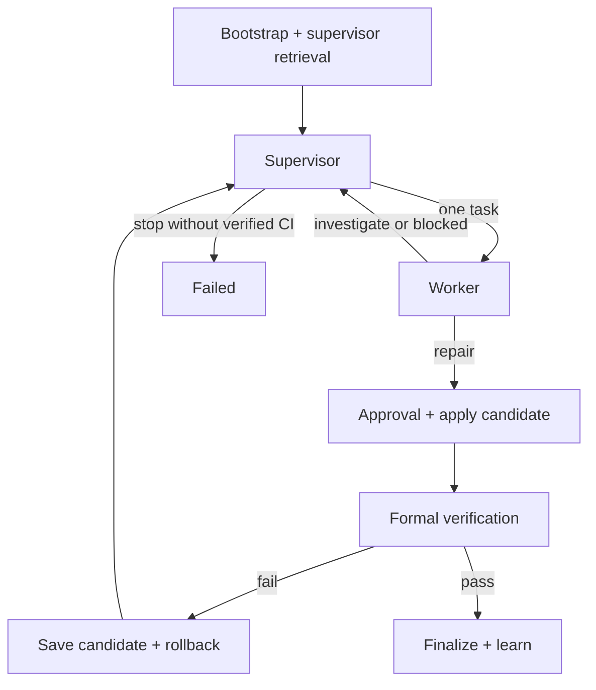

# Architecture

EvoCI owns orchestration. Leaf agents cannot spawn agents, write memory, mutate the capability
registry, or change the graph. Supervisor and Worker use the same bounded model/tool
loop, but receive different allowlisted views of the existing `ToolRegistry`.

A run has at most three supervisor batches and dispatches exactly one Worker task at a time.
Investigate results return to the Supervisor. Repair results are applied, then formally verified.
Repair workers operate on a private staging copy; the harness collects staged edits and is the only
writer of the parent workspace. Supervisor tools are read-only. Formal CI failure returns evidence
to the Supervisor instead of blindly rerunning the same Worker. There is no model Reviewer;
deterministic CI-bypass checks remain. Token totals are recorded but do not stop a run.

Patch application persists an apply plan before writes. Replay treats files already at the target
as done, files still at the parent baseline as pending, and any other content as a conflict.
Verification failure restores the parent snapshot. Apply conflicts restore only this attempt's
writes so third-party edits are left in place. Governance checks inspect the complete final
workspace diff.

The graph compiles against an async SQLite checkpointer. Events and run metadata live in
separate SQLite stores so trajectory analysis does not require inflating checkpoint state.
Model calls, tool calls/results, failed attempts, evidence, verification, and attribution all enter
one append-only event stream. `TrajectoryView` is a projection of those events and is the source for
metrics, episodes, skill outcomes, and experience mining.

An atomic `RunRepairBudget` is shared by Supervisor, Worker, graph-owned apply, and verification.
Task-level model/tool call limits bind the Worker loop together with the run budget. Resume
reconstructs repair consumption from events. Memory consolidation and skill mining run after the
core outcome is frozen; their cost is separately attributed to post-run telemetry and their failures
emit `LearningError` rather than changing a successful run to failed.

Agent event identities include a deterministic invocation ID derived from graph state:
`supervise:{batch}` and `worker:{batch}:{task_id}`. A resumed logical invocation reuses its ID for
idempotency.

The command/path controls are application guardrails. OS/container sandbox and security isolation
remain intentionally deferred.
