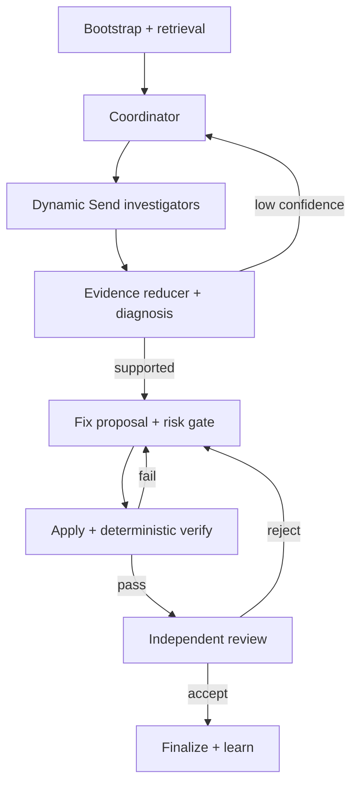

# Architecture

EvoCI owns orchestration. Leaf agents cannot spawn agents, write memory, mutate the capability
registry, or change the graph. Investigators, fixer, and reviewer use the same bounded model/tool
loop, but receive different allowlisted views of the existing `ToolRegistry`.

Investigation is bounded to four initial workers, eight total tasks, and three diagnosis rounds.
Parallel workers append to reducer-backed evidence and event lists. Fixer tools operate on a private
staging copy with independent filesystem, Git index, and HEAD metadata, then return full-file edits;
real workspace writes happen only after the graph's risk decision. Investigator and reviewer reads
target the real workspace, but every command, test, and non-writing skill script executes in a
disposable copy. Worker capability and skill-manifest permission are both required for a skill to
write a writable worker workspace.

Patch application compares current content with desired content before checking the expected source
hash. This makes already-applied updates/creates and already-absent deletes successful no-ops after
checkpoint replay. Every repair attempt records a baseline. Verification failure or reviewer
rejection restores that baseline, and the next fixer receives prior verification, review blockers,
and an attempt summary. Governance checks inspect the complete final workspace diff.

The graph compiles against an async SQLite checkpointer. LangGraph pending writes preserve successful
parallel branches if another branch raises or the process exits. Events and run metadata live in
separate SQLite stores so trajectory analysis does not require inflating checkpoint state.
Model calls, tool calls/results, failed attempts, evidence, verification, and attribution all enter
one append-only event stream. `TrajectoryView` is a projection of those events and is the source for
metrics, episodes, skill outcomes, and experience mining.

An atomic `RunRepairBudget` is shared by coordinator, parallel investigators, diagnoser, fixer,
reviewer, graph-owned apply, and verification. Resume reconstructs repair consumption from events.
Memory consolidation, experience mining, promotion, and curator execution run after the core outcome
is frozen; their cost is separately attributed to post-run telemetry and their failures emit
`LearningError` rather than changing a successful run to failed.

Agent event identities include a deterministic invocation ID derived from graph state:
`investigation:{task_id}`, `diagnosis:{investigation_round}`, `repair:{repair_attempt}`, and
`review:{repair_attempt}`. A resumed logical invocation reuses its ID for idempotency, while a later
repair or review attempt cannot collide with iteration-one events from an earlier attempt.

The command/path controls are application guardrails. OS/container sandbox and security isolation
remain intentionally deferred.
