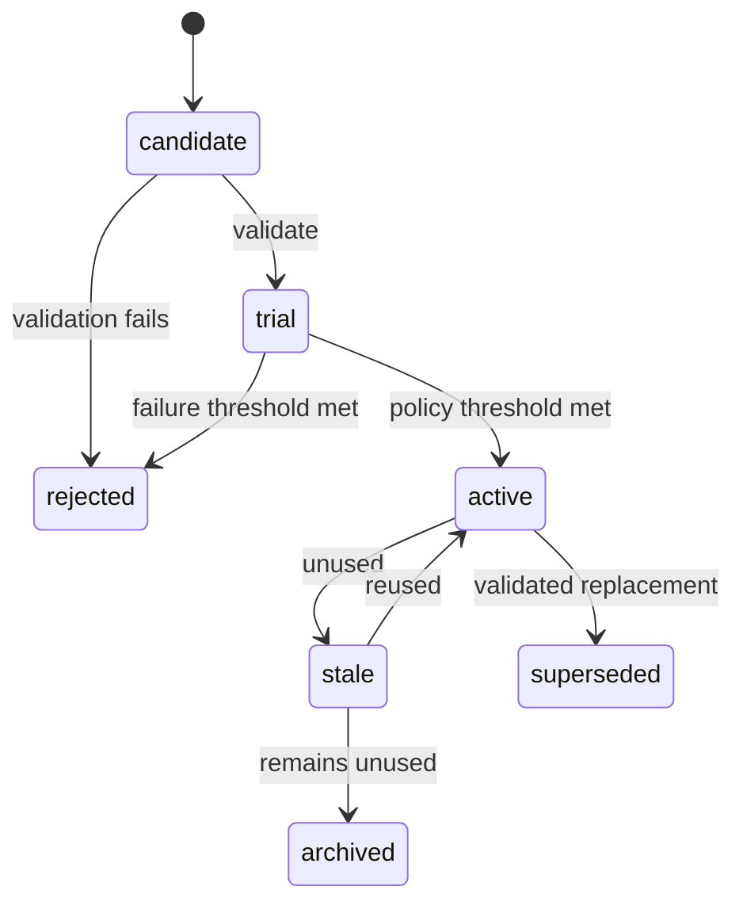

# Capability registry

A capability is a versioned package, not a prompt fragment. `SKILL.md` and `manifest.json` are
required; scripts, references, templates, tests, and assets are optional. Package files are hashed
and made read-only. A revised capability creates a new version instead of overwriting history.

Validation covers safe relative paths, immutable hashes, required package structure, secret scans,
dangerous text, Python AST policy, syntax, and package tests in a temporary copy with a restricted
environment and timeout. Script execution additionally requires trial/active status, declared
manifest membership, explicit execute permission, path containment, and bounded output.

`run_skill_script` is a formal leaf tool and is limited to capabilities selected for the current
run. Its trace records skill/version, agent, stable invocation, resource, and execution result.
Explicit script failure is always failure evidence; a successful run can credit an actually used
skill only when that skill has no explicit execution failure. Trial evidence uses configurable
minimum uses, successes, success rate, and maximum failures, and each skill/run outcome is recorded
idempotently.

Statistics distinguish retrieval, selection, and execution. Utility is provided by a strategy with
configurable success, tool-reduction, and retry-reduction weights. The deterministic curator handles
age, usage, utility, and lifecycle transitions; semantic duplicate/merge proposals remain a model
concern and must produce a new validated target before sources become superseded.
The registry rejects a colliding `new_skill` slug rather than inventing an orphan version. Updates
name an exact skill ID and parent version, create the next version under that same ID, and leave the
parent active until the child promotes. Every version after v1 therefore has explicit lineage.
Curator merge candidates follow the same rule: complete package review, new validated trial,
observed use, promotion, then source supersession.
